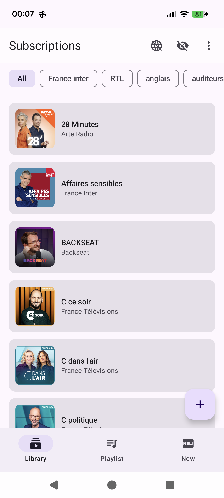
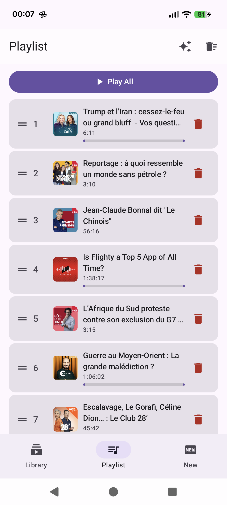
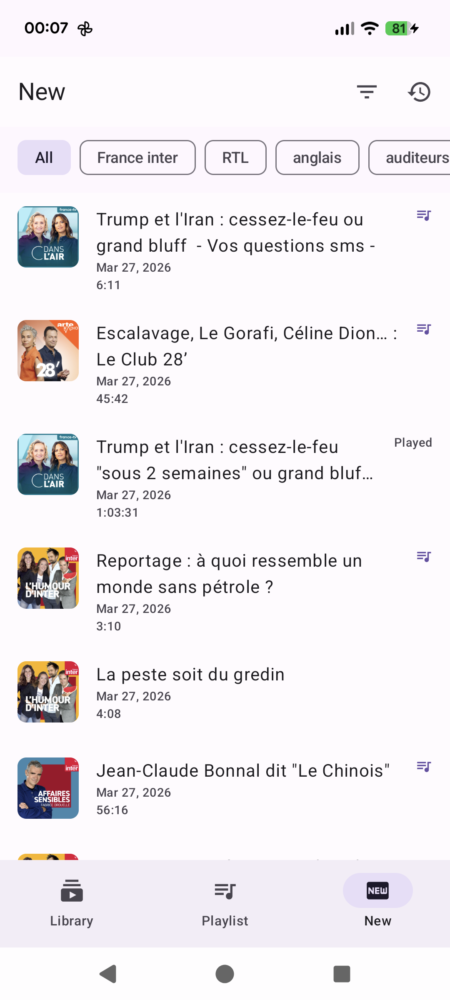
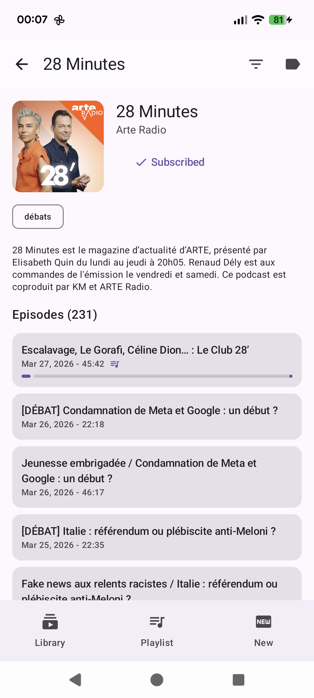
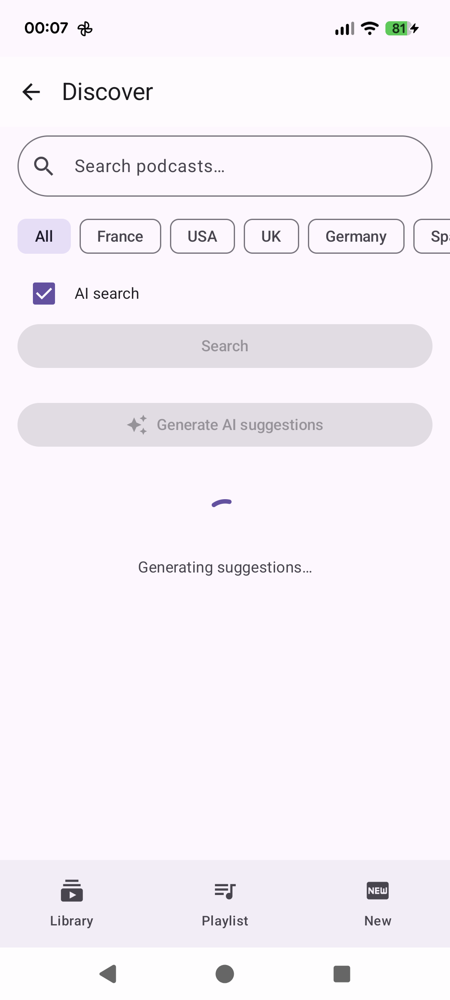
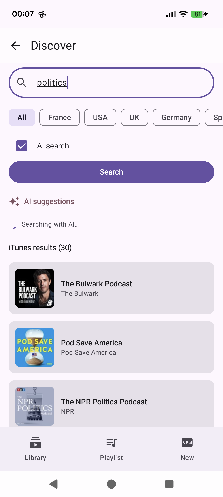
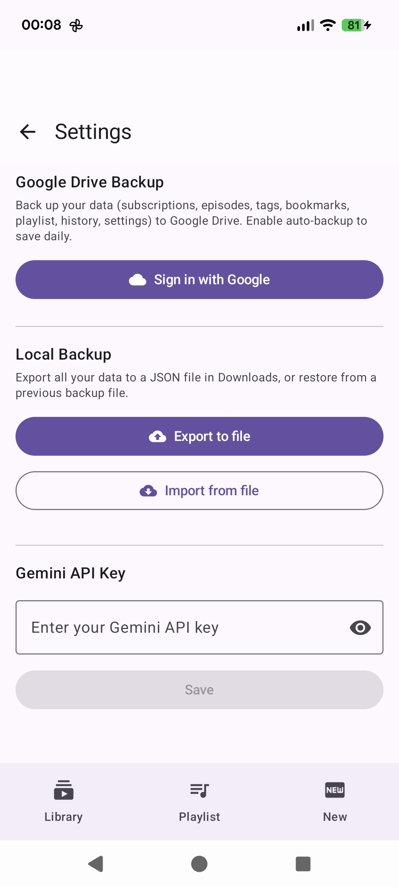
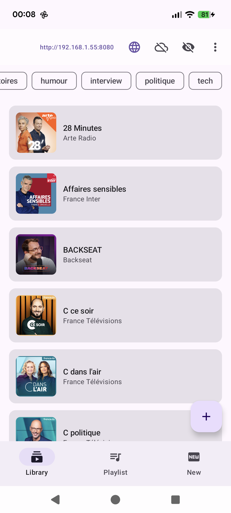

# Podcasto

A full-featured podcast player for Android with an embedded web management interface, built with Kotlin and Jetpack Compose.

## Features

### Android App
- **Discover** -- Search for podcasts via the iTunes Search API, filter by country (FR, US, GB, DE, ES, IT, BR, JP), AI-powered search suggestions via Gemini (opt-in)
- **AI Discovery** -- Generate personalized podcast recommendations based on your library using Gemini 2.0 Flash
- **Subscribe** -- Follow your favorite podcasts and organize them with custom tags
- **Browse episodes** -- View episode lists sorted by date, filter played/unplayed, now-playing indicator, stale podcast detection (3+ months without new episodes)
- **Playback** -- Stream or play downloaded episodes with Media3 (ExoPlayer), background playback with media notification and custom seek buttons (rewind 10s / forward 30s), volume normalization (LoudnessEnhancer)
- **Playlist** -- Queue episodes, drag-to-reorder, long press to play directly, auto-fill with the latest unplayed episode from each subscription (or filtered by tag), auto-advance to next episode, live progress bars
- **New Episodes** -- Dedicated screen showing latest episodes from all subscriptions, with tag filtering and played/unplayed toggle
- **Listening History** -- Track all listened episodes with timestamps
- **Downloads** -- Download episodes for offline listening
- **Bookmarks** -- Bookmark moments in episodes with comments, tap to seek
- **Progress tracking** -- Playback position is saved and restored (including when switching episodes or using "Play All"), episodes are marked as played on completion and removed from playlist
- **Hidden podcasts** -- Long press on a subscription to hide it from the library (toggle visibility with the eye icon)
- **Backup & Restore** -- Export all data (podcasts, episodes, tags, bookmarks, playlist, settings) to a local JSON file, or import from a previous backup. Google Drive backup with optional auto-backup every 24h via WorkManager
- **Settings** -- Configure Gemini API key, Google Drive backup, and volume normalization from the overflow menu
- **SSH Tunnel** -- Expose the web server to the internet via localhost.run (JSch SSH tunnel, no signup required)
- **Apple Podcasts fallback** -- Podcasts without a feed URL in the iTunes API (e.g. Radio France) are resolved by scraping the Apple Podcasts web page
- **Internationalization** -- Full English and French translations

### Web Interface
- **Embedded web server** -- Access your podcast library from any browser on the local network (Ktor CIO)
- **Full library management** -- Browse subscriptions, episodes, subscribe/unsubscribe, tag management, hidden podcasts toggle
- **Web player** -- Play episodes directly in the browser with progress tracking, volume normalization (DynamicsCompressor)
- **Playlist management** -- View, reorder (drag & drop), auto-add episodes
- **AI search & discovery** -- Same Gemini-powered features as the Android app
- **Listening history** -- View and track listening history from the web
- **New episodes** -- Browse latest episodes across all subscriptions
- **Backup & Restore** -- Export/import all data as JSON directly from the web settings
- **Settings** -- Configure Gemini API key from the web interface

## Screenshots

<!-- SCREENSHOTS_START -->
<p align="center">
  
  
  
  
  
  
  
  
  
  
</p>
<!-- SCREENSHOTS_END -->

The app uses a fixed Material 3 purple theme with a three-tab layout (Library, Playlist, New). Discover is accessed via a FAB button in the Library screen. The web server can be started/stopped from the Library toolbar.

## Tech Stack

| Layer | Technology |
|-------|-----------|
| UI | Jetpack Compose, Material 3 |
| Navigation | Navigation Compose |
| DI | Hilt |
| Database | Room (SQLite) v5 with versioned migrations |
| Network | Retrofit, OkHttp |
| Media | Media3 / ExoPlayer |
| Images | Coil |
| Drag & drop | sh.calvin.reorderable |
| Web Server | Ktor CIO 2.3.12 |
| AI | Google Generative AI (Gemini 2.0 Flash) |
| SSH Tunnel | JSch (mwiede fork) + localhost.run |
| Backup | Google Drive API (App Data folder), WorkManager |
| Auth | Google Sign-In (Play Services Auth) |

## Project Structure

```
app/src/main/java/com/ghostwan/podcasto/
  data/
    local/         -- Room entities, DAOs, database (v5 with migrations)
    remote/        -- iTunes API service, RSS parser, Apple Podcasts scraper
    repository/    -- PodcastRepository (single source of truth, backup export/import)
    backup/        -- GoogleDriveBackupManager, AutoBackupWorker (WorkManager + Hilt)
  di/              -- Hilt AppModule
  player/          -- PlayerManager (position saving, polling, auto-advance, volume normalization),
                      PlaybackService (Media3 with custom notification buttons, LoudnessEnhancer)
  ui/screens/      -- Compose screens (Discover, Subscriptions, PodcastDetail,
                      EpisodeDetail, Playlist, Player, NewEpisodes, History, Settings)
  web/             -- WebServerService, WebRoutes (Ktor REST API), TunnelManager (SSH tunnel)
  MainActivity.kt
  PodcastoApp.kt   -- Hilt application, HiltWorkerFactory integration
  PodcastoNavHost.kt
  NavHostViewModel.kt

app/src/main/assets/web/  -- Web UI (HTML/CSS/JS single-page app)
app/src/main/res/
  values/          -- English strings (default)
  values-fr/       -- French translations
```

## Building & Running

Requirements: Android SDK, a connected device or emulator (minSdk 26).

```bash
# Build, install, and launch in one step
./run.sh

# Or manually
./gradlew assembleRelease
adb install -r app/build/outputs/apk/release/app-release.apk
adb shell am start -n com.ghostwan.podcasto/.MainActivity
```

### Web Interface

Start the web server from the Library screen toolbar (globe icon). The server URL is displayed in the toolbar and can be copied by tapping it. If your phone and computer are on the same network, access it directly. Otherwise, use USB port forwarding:

```bash
./portforward.sh   # adb forward tcp:8080 tcp:8080
# Then open http://localhost:8080
```

#### SSH Tunnel (Remote Access)

You can also expose the web server to the internet via an SSH tunnel (localhost.run). Toggle the tunnel from the cloud icon in the Library toolbar. The generated public URL (e.g. `https://xxxxx.lhr.life`) can be shared to access the web interface from anywhere -- no signup or configuration required.

### AI Features

To enable AI-powered search and discovery, you can either:

1. **In-app settings** (recommended): Go to Settings (overflow menu in Library) and enter your Gemini API key
2. **Build-time**: Add your key to `local.properties`:

```properties
GEMINI_API_KEY=your_key_here
```

Get a free API key from [Google AI Studio](https://aistudio.google.com/apikey).

### Backup & Restore

**Local backup**: From Settings, export all your data to a JSON file in Downloads, or import from a previously exported file. Also available from the web interface settings.

**Google Drive backup**: Sign in with your Google account in Settings to back up to Google Drive's App Data folder. Enable auto-backup for automatic daily backups. Requires a configured OAuth client ID in Google Cloud Console (Android type, with your app's package name and signing certificate SHA-1).

## License

MIT -- see [LICENSE](LICENSE).
